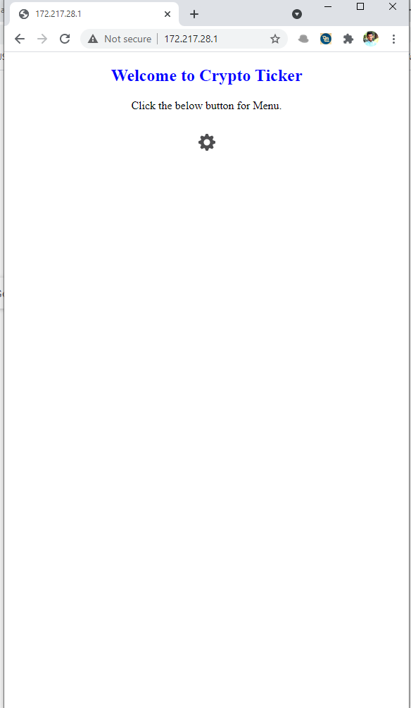
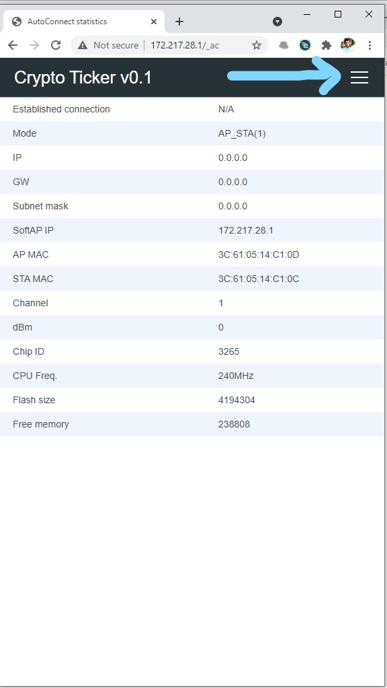
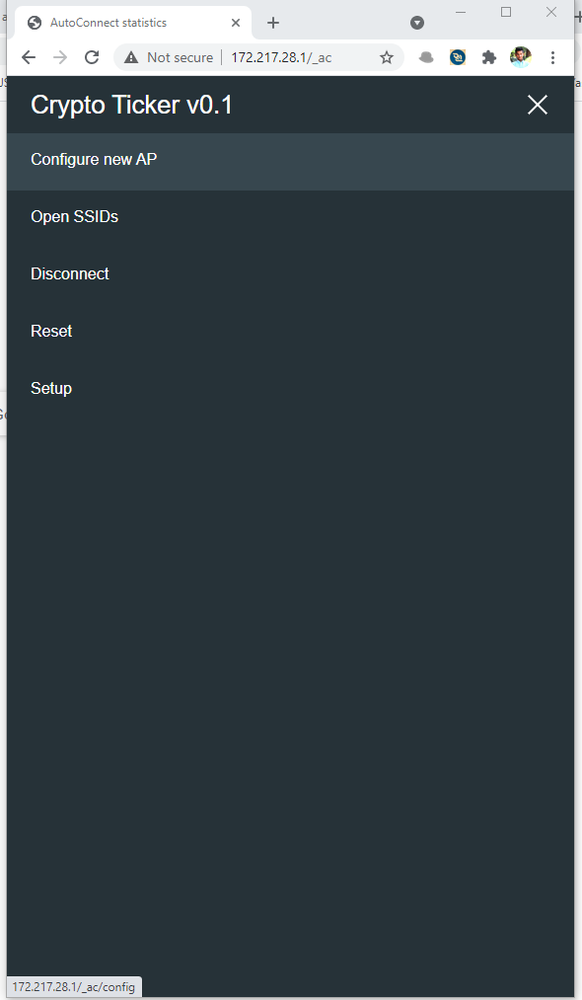
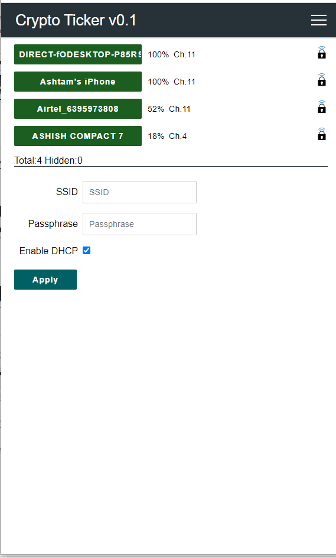
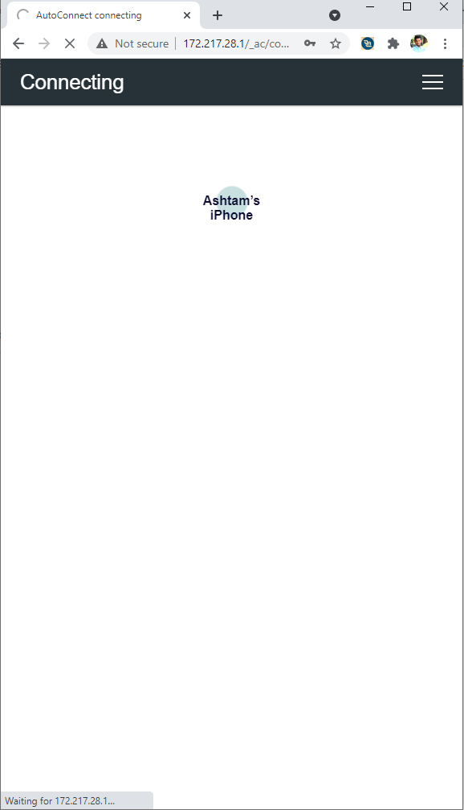
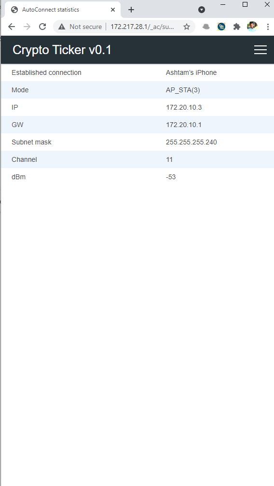
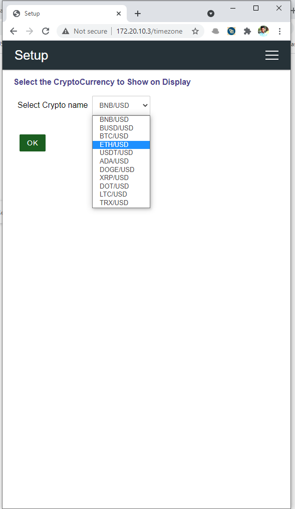

# CryptoCurrency Ticker

A handheld device which is use for monitoring cryptocurrencies prices in realtime. It is based on ESP32 board and the API used for getting live accurate data is by CoinGecko. ESP32 is attach with MAX2719 dot matrix display for showing prices. Using the ESP32 freeRTOS task, Updating the dot matrix, fetching data from CoinGecko, and other internal tasks are running simultaneously. 

## Steps for Configuring the device

* Plug the device to 5v power supply via mobile adapter or any other port which outputs 5v power. Current usage is more than 600 mA.
* After device is on, display will shows an startup message - "Crypto Ticker".
* After this message goes, a new message will come - "Portal Started , IP: 172.217.28.1". This step is for wifi provisioning.
* Connects your mobile or laptop device to the device wifi - "Crypto Tracker". After connected, open the browser and goto the IP address above mentioned. 
* Homepage will be open up.
    
    
* Click on the settings icon. A page will open which shows the current stats of the device. Then click on the Menu icon shows by an arrow.
    
    

* Menu page contains all the items which will help user to control the device. Click the "Configure new AP" button.

    

* On this page a list of wifi is shown. Select the Wifi you want to connect and enter the password.

    

* Device will now trying to connect to your wifi. After success it will opens the stats page with the latest IP. You have to copy this IP address as it will be required in further steps.

    

* Device is successfully connected to you wifi. If it is not connected start from first step.

* Now you have to connect your mobile device to the Wifi device is connected. After connected you have to input the IP of the device which you noted from previous step. Homepage will open, click the settings icon, go to menu, select "Setup" for choosing which crypto to show on device. After selecting the crypto press OK. It will send the request to device and you will be redirected to Home page. In a matter of 1-2 secs you will be seeing your crypto price.

    

